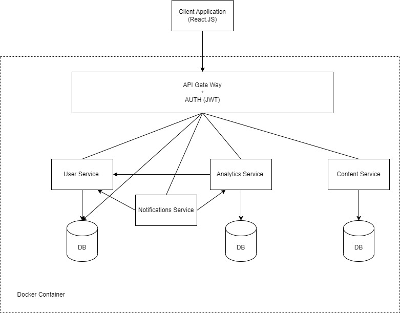
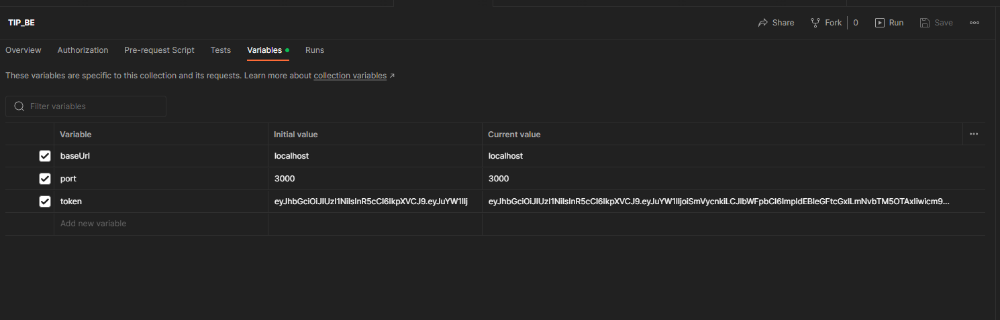

# Technology Inquiry Project Back-End.

## 1.Architecutre

- All components of the system are built using node.js and express.
- Relational databases use PostgresSQL.
- Document databases use MongoDB.
- Each service and DB will run in their own docker container.

## 2. How to setup

##### 1. Linux / WSL / Mac

Docker must be installed on your system prior to running the application

1. Clone the repository.
2. navigate to TIP_BE folder
3. run `docker-compose up`
   this command will take longer the first time you run it. But should not be a problem for subsequent commands. However if containers fail to start for some reason at this stage you will have to manually start the faulty containers.
   - There are 4 images that will spinup 4 containers,
     1. api-gw
     2. content-service
     3. usrdb
     4. content-db

    **api-gw** and **content-service** have a dependency on *usrdb* and *content-db*, incase api-gw or content-service fails to start you can manually start them by running `docker-compose up api-gw -d` and `docker-compose up content-service -d` note the `-d` flag which will start the containers in detached mode.
4. Finally invoke the API's through postman.

- Download the postman collection at 

## 3. Invoking APIs through postman.
### ****** NOTICE ALL API DOCUMENTATION NOW MOVED TO POSTMAN WORKSPACES use link to join https://app.getpostman.com/join-team?invite_code=fcfc0bc8eaa2a29a1eb97151a3f94e4d ****
### PLEASE CREATE YOUR OWN FORK ON POSTMAN DO NOT CHANGE THE ORIGINAL COLLECTION!!!!!!
- Download postman.
- Import the [postman collection](https://github.com/UmenR/TIP_BE/blob/main/TIP_BE.postman_collection.json)

current available API endpoints,
- Register
- Login
- Content
- User Services
  - Add Test Result (/users/addTestResult)
  - Get Test Results (/users/getTestResults/{user_id})
  - Add Purchase Kit record (/users/orders)
  - Get User Test Kits (/users/getUserTestKitOrders/{user_id})
  - Get All Users (/users/getUsers)
  - Add User Demographics (/users/addUserDemographics)
  - Get User Demographics (/users/getUserDemographics/{user_id})

Once the all BE containers are running according to step 2, Invoke the Register endpoint with the sample data on postman, You should get a JSON response with a `token` filed. Copy the token and paste it on to the **current value** of **token** variable of the postman collection. 

proceed to invoke other endpoints.

## 4. Folder Structure

- All services have their own folder. Please develop all functionalities related to each service inside these folders.
- Each service must have its own `Dockerfile` with instructions on how to build the service.
- All DB's must be specified in the `docker-compose.yml` file.
- All initialization scripts must reside in a folder with the name of the service they belong to eg:(`scripts/userdb`) inside `scripts` folder under `INIT_DB`.
- IF required any persisted volumes can go inside `INIT_DB/data/{SERVICE_NAME}` however this is not commited and ignored by GIT therfore do not put data that must be in initialization scripts in these DBs. 

## 5. Running Tests.
- Jest and supertest is used to test the API's and their responses.
- A DB is required for the tests, Therfore first run the DB service using docker-compose, i.e `docker-compose up usrdb -D`.
- Next navigate to the service you need to test i.E `cd API_GW`
- Run tests, `npm test`
